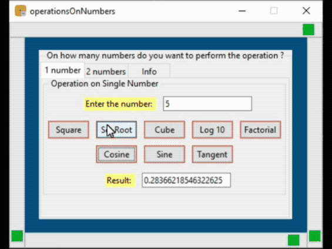

This GUI app is developed by Nirmal Banerjee on 30th April 2020 during the COVID-19 lockdown. 
========================================================================================================================

Anybody is free to use the source code of the app.

========================================================================================================================

The first folder (executable(.exe)) contains an executable file named 'python.exe'. The python script was converted to an .exe file using pyinstaller. 

The second folder (pyhton script) contains the source code and the logo.

========================================================================================================================

Connect with me @

LinkedIn: https://www.linkedin.com/in/nirmalbanerjee/ 
Github: https://github.com/nirmalbanerjee 
Instagram: https://www.instagram.com/light_on_sensor

========================================================================================================================

